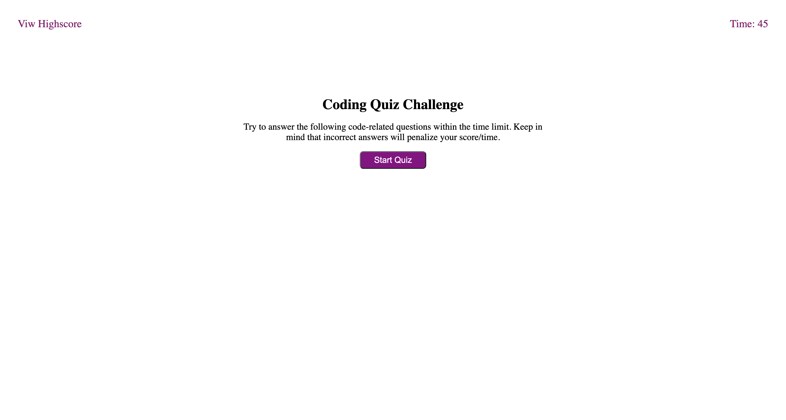
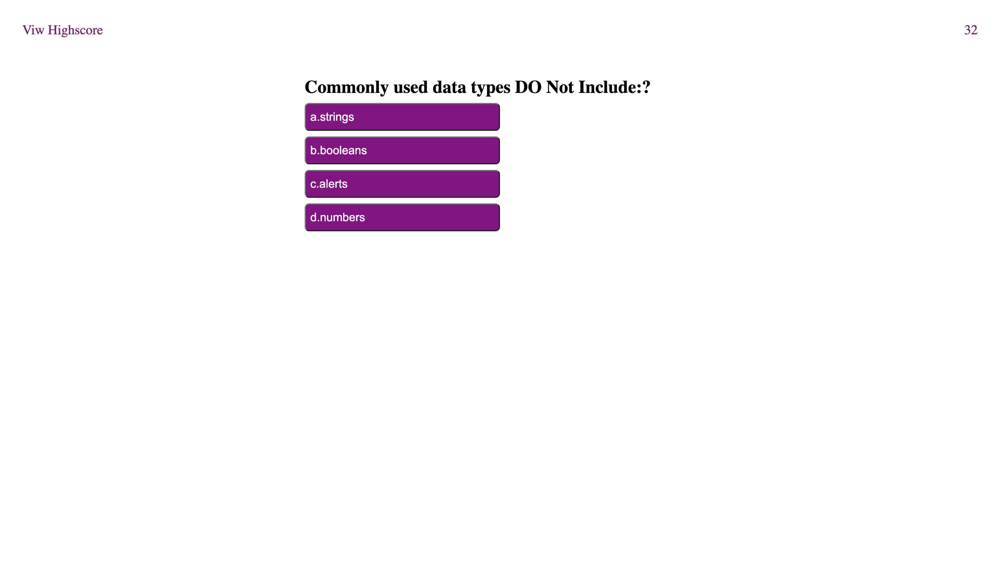
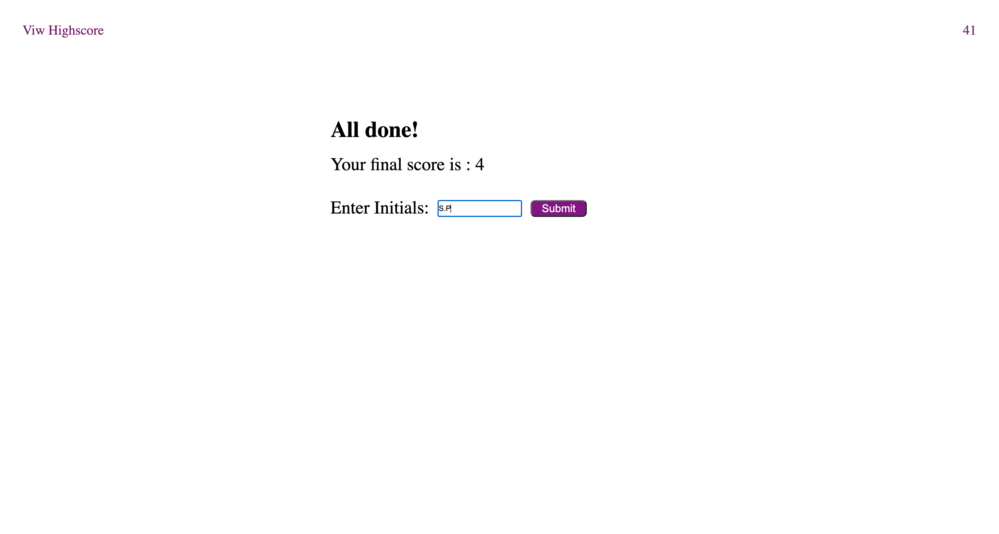

# 04 Web APIs: Code Quiz
Timed Coding Quiz with multiple-choice questions.

## Table of Contents

1. Descriptions  
2. Visuals 
3. Website

## Descriptions
This project is created using HTML,CSS and JavaScript as the main language to enhance user experience. The Code Quiz Challenge has the following features.
* The timer will start to countdown once the user clicks the start button which will also display the first set of question. 
* The users will have 45 seconds to complete all set of questions.
* The timer on the top right of the screen is displaying the remaining time.
* After user selects the answer the next question will display. This will continue until the timer is at 0 or the user has completed all the questions.
* The user will be able to view the score and input the initials at the end of the Code Quiz Challenge.


## Visuals
```pip 
User can have a quick review of how the Code Quiz Challenge works. 
```


```pip
Set of questions with multiple-choices.
```


```pip
User can review the score and input the initials
```


## Website 
[Coding Quiz Challenge](https://sasimapatterson.github.io/code-quiz/)


